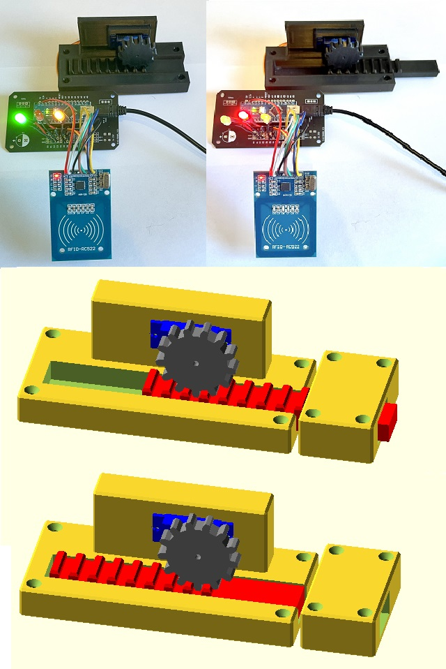
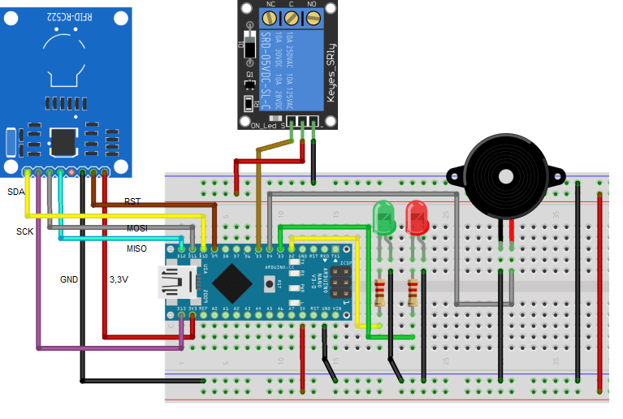
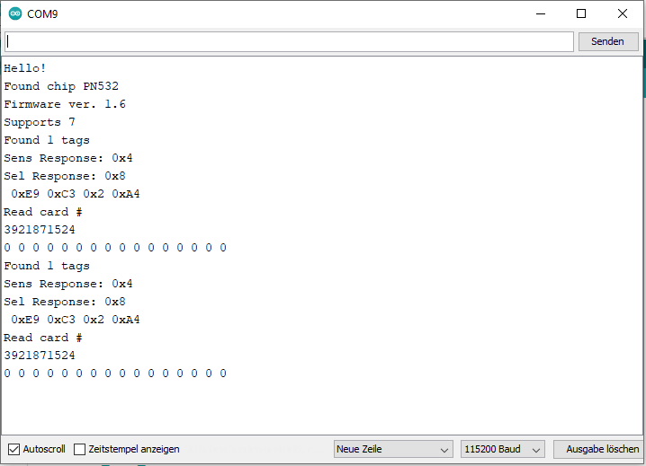
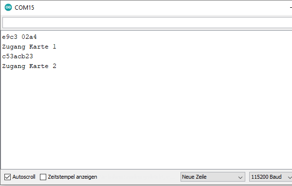
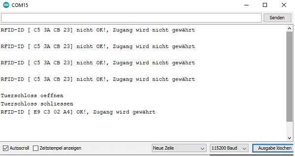
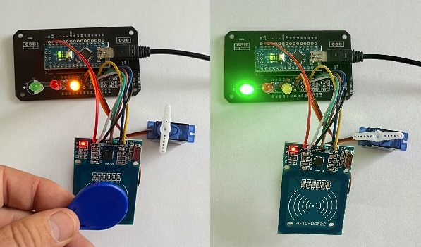
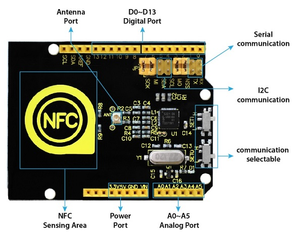

|[:skull:ISSUE](https://github.com/frankyhub/RFID-Zugangskontrolle/issues?q=is%3Aissue)|[:speech_balloon: Forum /Discussion](https://github.com/frankyhub/RFID-Zugangskontrolle/discussions)|[:grey_question:WiKi](https://github.com/frankyhub/RFID-Zugangskontrolle/wiki)||
|--|--|--|--|
| | | | |
||<a href="https://github.com/frankyhub/RFID-Zugangskontrolle/issues">|<a href="https://github.com/frankyhub/RFID-Zugangskontrolle/discussions">|<a href="https://github.com/frankyhub/RFID-Zugangskontrolle/releases">|
|| <a href="https://github.com/frankyhub/RFID-Zugangskontrolle/pulse" alt="Activity">| <a href="https://github.com/frankyhub/RFID-Zugangskontrolle/graphs/traffic">  |<a href="https://github.com/frankyhub?tab=stars"> |

# RFID-Zugangskontrolle
Türschloss, LED-Anzeige, Relais-Anschluss oder Servo-Motor

## Story

Mit diesem Projekt wird ein RFID-Kartenleser (RFID=radio frequency identification) für eine Zugangskontrolle eingesetzt. Zunächst muss der RFID-Transponder oder die RFID-Karte ausgelesen werden. Der ausgelesene "Code" wird im Hauptprogramm für den Zugang verwendet und z.B. ein Türschloss geöffnet.
Die Grüne LED zeigt blinkend die Verwendung des korrekten Transponder an, die rote LED zeigt blinkend einen ungültigen Transponder an. Ein Ausgang ist für einen Relais-Anschluss für ein Türschloss vorgesehen und ein Ausgang optional für einen Servo-Motor.

## Hardware

Die Stückliste für die RFID-Zugangskontrolle:

+ 1 x Arduino NANO
+ 1 x RFID-RC522 Modul
+ 1 x Transponder mit Schlüsselring
+ 1 x Transponder im Kartenformat
+ 1 x Relais für den Türöffner (optional)
+ 1 x rote LED mit 100R Vorwiderstand
+ 1 x grüne LED mit 100R Vorwiderstand
+ 1 x Buzzer (optional)
+ 1 x Relais für den Türöffner (optional)
+ 1 x Servo-Motor (optional)
+ Kleinmaterial, Schaltdraht

## Verdrahtung

+ NANO D2 -> grüne LED
+ NANO D3 -> rote LED
+ NANO D4 -> Buzzer
+ NANO D5 -> Relais
+ NANO D7 -> ServoMotor

## Software
Die Software wird mit der Arduino IDE in den NANO geladen.

+ Mit dem Programm "01-RFID_Auslesen_NANO.ino" wird die RFID-ID aus dem Transponder oder Karte ausgelesen.
+ Das Programm "04_RFID_LED_ansteuern_2_Karten_Servo_LAB_NANO.ino" ist das Hauptprogramm für die Zugangskontrolle.

RFID-Code mit dem Seriellen Monitor auslesen

RFID-Zugangsinformationen mit dem Seriellen Monitor auslesen

## Aufbau der RFID-Zugangskontrolle

## RFID-Zugangskontrolle mit Servo-Motor Verschlusseinheit

## PIN-OUT RFID-Shield

---

   
<ol class="breadcrumb" style="border-top: 2px solid black;border-bottom:2px solid black; height: 45px; width: 900px;"> 
<a href="#oben">nach oben</a>
</ol>

  

---

